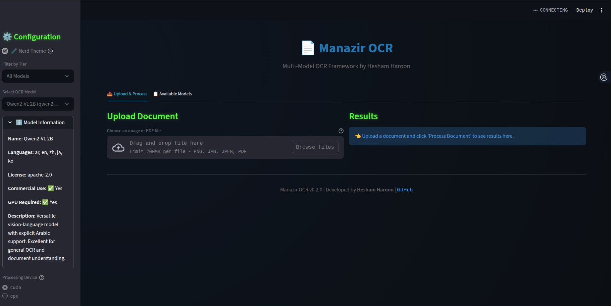
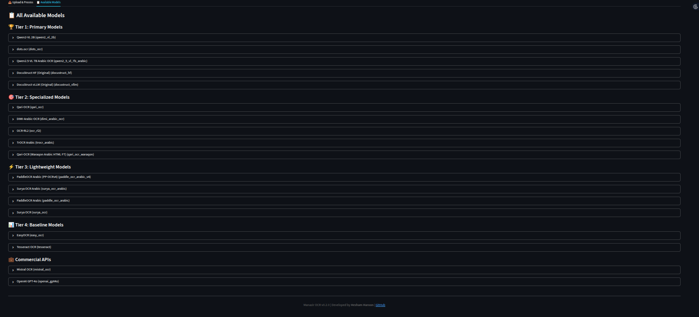

> # Manazir OCR — Arabic optics‑inspired multi‑model OCR



**Manazir OCR** is an Arabic‑first, layout‑aware OCR framework inspired by Ibn al‑Haytham’s Kitāb al‑Manāẓir (Book of Optics). It orchestrates multiple backends (local Transformers, vLLM servers, lightweight engines, and commercial APIs) to extract high‑quality text from PDFs and images, producing Markdown/HTML with layout blocks and figure crops.

## 🌟 Features

- **Arabic‑first multi‑model architecture**: choose or auto‑route among VLMs and classic OCR.
- **Layout‑aware outputs**: HTML/Markdown with reading order, chunk metadata, and image extraction.
- **Flexible runtimes**: local Hugging Face (Transformers) or remote vLLM; pluggable registry + factory.
- **CLI and Streamlit UIs**: production CLI and two apps (basic + professional, with an optional Nerd theme).
- **Extensible**: add models via a simple registry entry; commercial APIs optional.

## 🚀 Quickstart

Install from source (recommended):

```bash
python -m venv venv
source venv/bin/activate  # on Windows: venv\Scripts\activate
pip install -U pip
pip install -e .
```

Run the CLI:

```bash
# Batch processing with layout-aware pipeline (vLLM or HF)
manazir process <input_path> <output_dir> --method vllm --paginate_output

# Arabic-first single-file OCR with model selection
manazir ocr file.pdf --language ar --quality highest --device cuda

# Browse models and get recommendations
manazir list-available-models
manazir recommend --language ar --document-type handwritten
```

Launch the apps:

```bash
manazir_app          # Basic demo (choose Classic hf/vllm or pick a Registry model)
manazir_app_pro      # Professional UI (toggle Nerd Theme in sidebar)
```

## ▶️ How to run

1) Run the Professional app (recommended):

```bash
manazir_app_pro
# then open http://localhost:8501
```

Alternative:

```bash
python -m docustruct.scripts.run_app_professional
```

2) Run via CLI:

```bash
# Convert a PDF to Markdown using Arabic-first defaults
manazir ocr input.pdf --language ar --output out_dir

# List models and pick one
manazir list-available-models
manazir ocr input.png --language ar --model qwen2_vl_2b
```

## 🧩 Supported Arabic models (highlights)

- Specialized: `qari_ocr`, `dimi_arabic_ocr`, `ocr_rl2`, `trocr_arabic`
- Multilingual VLMs: `qwen2_vl_2b`, `qwen2_5_vl_7b_arabic`
- Lightweight: `paddle_ocr_arabic`, `paddle_ocr_arabic_v4`, `tesseract`, `easy_ocr`
- Layout toolkit: `surya_ocr`, `surya_ocr_arabic`
- Commercial (optional): `openai_gpt4o`, `mistral_ocr`

Additions in this repo: `qwen2_5_vl_7b_arabic`, `paddle_ocr_arabic_v4`, `surya_ocr_arabic`, `qari_ocr_waraqon`.

### Model browser



## 🛠️ Programmatic usage

```python
from docustruct.model import create_model
from PIL import Image

model = create_model("qwen2_5_vl_7b_arabic", device="cuda")
img = Image.open("page.png").convert("RGB")
result = model.process_image(img)
print(result.text)
```

## ⚙️ vLLM (optional)

The CLI’s vLLM path uses OpenAI‑compatible endpoints. Configure via env:

```bash
export VLLM_API_KEY=EMPTY
export VLLM_API_BASE=http://localhost:8000/v1
export VLLM_MODEL_NAME=manazir
```

## 📑 Notes

- Import path remains `docustruct.*` for now; package name is `manazir-ocr`.
- Some backends require extra installs (e.g., `paddleocr`). Commercial APIs need keys and may incur costs.

## 📁 Assets

- Store project screenshots and images in `assets/`.
- Included: `assets/screenshot-ui.png`, `assets/screenshot-available-models.png`.

## 👤 Author

Developed by **Hesham Haroon** — contact: **heshamharoon19@gmail.com**.

## 📜 License

Code is Apache‑2.0. Some integrated models (e.g., Surya) are GPL‑3.0; verify licenses before use.
